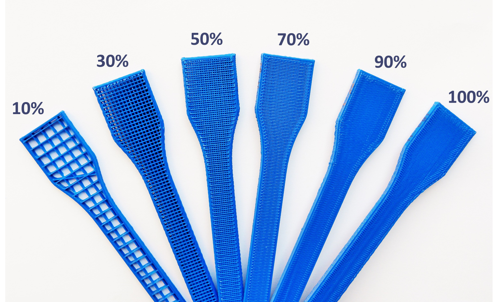

### Fused Deposition Modelling(FDM) process 

It is a 3D printing process where the material is fed into a heated nozzle from a chamber via rollers. The heated material is extruded onto a base plate, which solidifies on the plate. The nozzle/base plate moves in XY plane to deposit a layer of material. The base plate/nozzle moves in Z direction to aid the deposition of next layer on top of first layer. The whole product is built layer by layer.

</img>  
FDM Process Schematic  
( Source: I. J. Solomon, P. Sevvel, and J. Gunasekaran, “A review on the various processing parameters in FDM,” Mater. Today Proc., no. xxxx, pp. 10–15, 2020.)

### Process Parameters :
#### 1) Material

The materials used here are PLA (Poly Lactic Acid) and ABS (Acrylonitrile Butadiene Styrene).

#### 2) Layer height

It is the height of individual layers. For a given component, more layer height means lesser number of layers will be required to build it.

</img>  
Layer Height  
( Source: I. J. Solomon, P. Sevvel, and J. Gunasekaran, “A review on the various processing parameters in FDM,” Mater. Today Proc., no. xxxx, pp. 10–15, 2020. )

#### 3) Infill density

It is the amount of material filled in the product. Usually, fully compact (solid) top and bottom layers and a shell will be printed. The cavity formed like this will be filled with material. The percentage volume of the cavity that is filled is the infill density.

</img>  
Infill Density in percentage  
( Source: https://all3dp.com/2/infill-3d-printing-what-it-means-and-how-to-use-it/ )

#### 4) Print speed

The speed at which the extruder moves while depositing material.

### Effected Parameters :
#### Surface roughness

Surface roughness is measured as Ra or average surface roughness.

### Fixed Parameters :
#### 1) Part Geometry

Geometry of part is fixed as 80*10*4 mm³ which is a ASTM standard specimen size.

</img>  
Part Geometry  

 

#### 2) Raster pattern

It is the pattern in which the raster is applied. Line or recti-linear pattern is used here.

</img>  
Rectilinear raster pattern at ±45° angle in alternate layers  
( Source:https://www.researchgate.net/figure/Rectilinear-infill-pattern-for-a-a-single-layer-b-multiple-layers-and-c-observed_fig2_330366307)

#### 3) Number of top and bottom layers and shell and shell thickness.

Number of top and bottom layers is taken as 2 and 2 shells with 0.8 mm wall thickness is selected.

</img>  
The shell and top/bottom layers  
( Source: https://www.3dhubs.com/knowledge-base/selecting-optimal-shell-and-infill-parameters-fdm-3d-printing/ )

#### 4) Build Orientation

It is the orientation at which the product will be printed on the build plate. Build orientation is fixed as 0° or flat.

</img>  
Build orientation  
( Source: T. Yao, Z. Deng, K. Zhang, and S. Li, “A method to predict the ultimate tensile strength of 3D printing polylactic acid (PLA) materials with different printing orientations,” Compos. Part B Eng., vol. 163, no. December 2018, pp. 393–402, 2019. )

